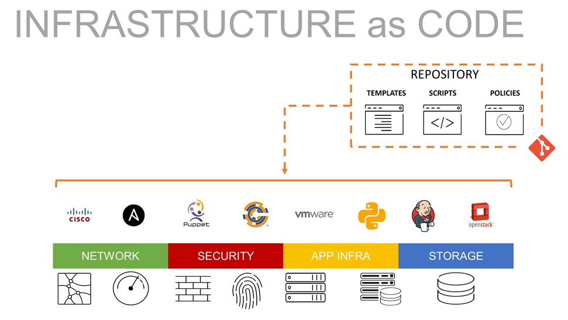

# terraform-guide
terraform-guide


## 강의 소개

<대상> <목적>

## Infrastructure as Code(IaC) 소개



클라우드 환경에서 리소스를 스핀-업 하려면 클라우드가 제공하는 관리 콘솔에 로그인하여 원하는 리소스 생성 관련 화면을 통해 주요 정보를 입력 및 생성 버튼을 클릭하고 나서야 인스턴스를 실행 할 수 있습니다.  
위와 같이 사용자가 관리콘솔에서 행해지는 작업들을 동일하게 코드로 구현에 내는것이 바로 인프라의 자동화 입니다.

### IaC 의 장점 
- 비용 절감: 클라우드에 숙련된 전문가가 필요하지 않습니다. 
- 배포 속도 향상: 코드로 정의한 스펙을 기반으로 빠른 프로비저닝을 보장 합니다.
- 오류 감소: 코드로 정의한 스펙을 기반으로 사람의 실수를 방지하거나 누락되거나 잘못된 설정읠 쉽고 빠르게 보완할 수 있습니다.
- 인프라 일관성 향상: 코드로 정의한 스펙은 클라우드 계정 / 리전에 동일하게 프로비저닝 됩니다.
- 구성 변동 제거: Git 과 같은 소스 버전 컨트롤을 통해 리소스 구성에 대한 임의적인 변경을 통제 합니다.  

### Terraform 의 장점

- DevOps 방법론: Terraform을 사용하여 안전하고 안전한 방식으로 버전 제어, 코드 검토, 지속적인 통합, 자동화된 테스트 및 지속적인 배포와 같은 DevOps 모범 사례를 따를 수 있습니다.
- 사용이 간편함: Terraform은 선택하고 배우기에 매우 쉬운 도구입니다. 방대한 온라인 커뮤니티와 존재는 말할 것도 없고 문서가 풍부하고 따라하기 쉽기 때문에 입문하는 데 몇일이면 충분합니다.
- 자체 문서화: Terraform 사용의 한 가지 이점은 코딩된 내용을 쉽고 명확하게 따를 수 있도록 거의 자체적으로 선언된 리소스/모듈로 문서화한다는 것입니다.
- 클라우드 불가지론적: Hashicorp는 다양한 CSP 의 API가 다르기 때문에 모든 CSP 를 지원하는 IaC 도구로 Terraform이 클라우드 불가지론적이라고 주장합니다.
- Module: 여러 리소스를 그룹화하여 재사용 가능하도록 모듈로 생성할 수 있고 이를 통해 동일한 템플릿으로 쉽게 서비스를 프로비저닝 할 수 있습니다.
- State: Terraform 리소스가 생성되면 플랫폼 내에서 추적 및 관리되는 해당 리소스에 대한 상태 파일이 생성됩니다. 이를 통해 REAL 환경과 구성상의 차이를 식별하고 동기화 할 수 있습니다. 
- Workspace: 작업 공간은 Terraform 코드를 논리적 그룹으로 구성하는 방법입니다. 예를 들어 네트워크, 서버 및 애플리케이션을 다른 상태 파일로 분할합니다.
- Provider Rich: Terraform에는 API를 통해 여러 클라우드 CSP 뿐만 아니라 많이 사용되는 오픈소스 서비스를 대상으로 리소스를 생성하는 'Provider'가 있습니다. 

<br><br>

# Practice

## 프로비저닝 환경 구성
[Terraform 설치](./lab-101/guide.md)


## Terraform Basic
Terraform의 기초를 이해 합니다.   
- [Terraform Basic](./lab-102/guide.md)  
- [Terraform Basic Lab](./lab-102/practice/handson.md)


## 대형 프로젝트의 프로비저닝 전략

Workspace  Terraform 코드를 논리적 그룹으로 구성하는 방법입니다.


```
```

프로바이더, 리소스, 변수, 아웃풋 의 이해

Terraform Basic - 짭게 소개 및 실습  - 프로바이더, 리소스, 변수, 아웃풋 의 이해
파일 확장자의 의미

Terraform Providers
Configuration Directory
Terraform Providers
실습 Multiple Providers
Using Input Variables
Understanding the Variable Block
실습 Variables
Resource Attributes
실습 Resource Attributes
Resource Dependencies
실습 Resource Dependencies
Output Variables
실습 Output Variables

Terraform State
Terraform State 소개
Purpose of State 목적
실습 Terraform State 관리 - 로컬 / 특정위치 /리모트
Terraform State Considerations - 고려사항
복잡한 아키텍처 구성을 위한 테라폼 프로젝트 구성전략
https://docs.aws.amazon.com/whitepapers/latest/best-practices-wordpress/images/image4.png
재해 복원 대응


Working with Terraform
Terraform Commands
실습 Terraform Commands
자동 실행
refresh 무시

Mutable vs Immutable Infrastructure
LifeCycle Rules
실습 Lifecycle Rules
Datasources
실습 Datasources

Meta-Arguments
depends_on
count
for_each
provider
lifecycle
Version Constraints
실습 Meta-Arguments


Terraform with AWS
Lab: Setup an AWS Account  & CLI
AWS IAM with Terraform
04:28
I
04:44
Lab: IAM with Terraform
00:00
Introduction to AWS S3
04:53
S3 with Terraform
04:27
Lab: S3
Introduction to DynamoDB


Terraform with AWS

Debugging
TF_LOG 환경 변수를 통한 로그 레벨 설정
TRACE, DEBUG, INFO, WARN, ERROR
TF_LOG_PATH 환경 변수를 통한 로그파일 경로 설정
정규표현식을 통한 입력 변수 제약 Using the error_message to validate variable value


AWS 클라우드 디자인 실습
고객 요구사항 시나리오 - 개발/운영 환경의 분리
네이밍 정책 및 태깅속성

실습: 다이어그램 작성
https://www.diagrams.net/

VPC 구성


Terraform Import
실습 Terraform Import

Terraform module
실습: 모듈 생성


고급

	Learn in 20 min terraform state file & terraform Import existing Infrastructure
	https://www.youtube.com/watch?v=3mTCc3xmlys


AWS Lambda & EventBridge | Schedule Start And Stop Of EC2 Instances Based On Tags

	https://dheeraj3choudhary.com/aws-lambda-and-eventbridge-or-schedule-start-and-stop-of-ec2-instances-based-on-tags


# 참고자료
https://github.com/aws-samples/aws-fargate-fast-autoscaler


### Bastion 요구 사항

클라우드 관리 목적으로 bastion ec2 를 하나만 생성 합니다.
- 비용 절감을 위해 t3 micro 인스턴스로 생성 합니다. 
- OS 는 ubuntu 20.
- Bastion 을 접속하는 public IP 는 bastion 이 재-생성 되더라도 변경되어선 안됩니다.
- 
```

```
- 
  : 

  - 
- bastion 을 접속하는 bastion 은 eip 가 변경되어선 안됨
