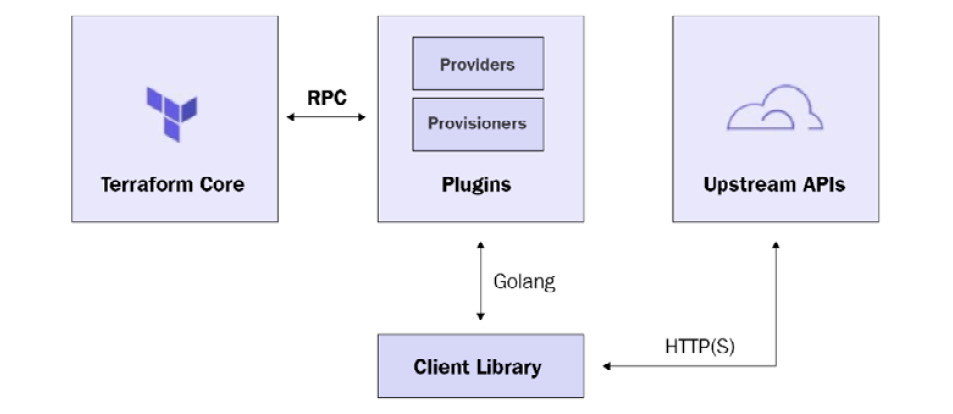
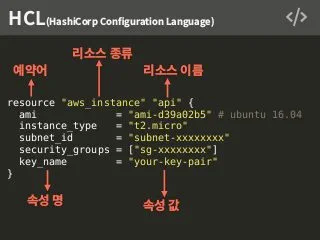
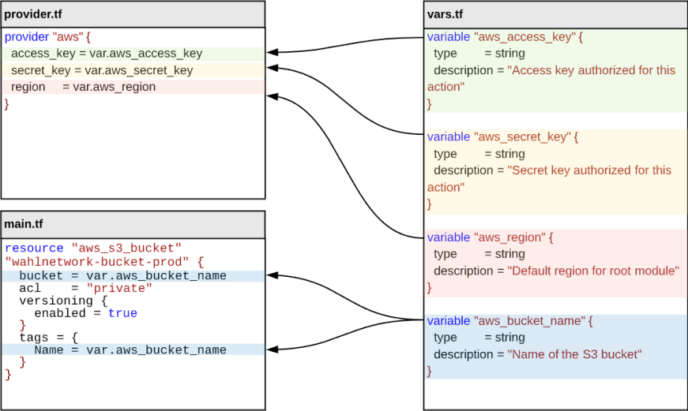
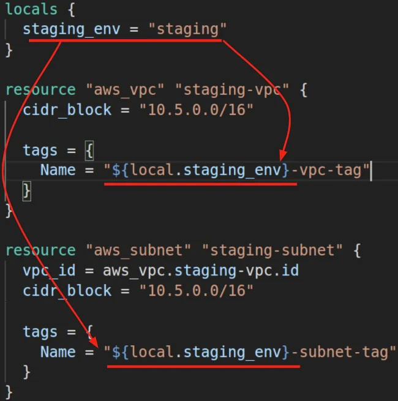
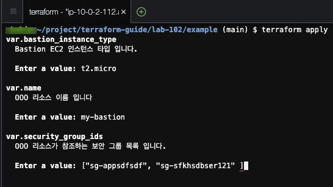

# Terraform 기초

Terraform 아키텍처를 통해 동작 방식을 살펴보고 Provider, Resource, Variable, Output, Datasource 과 같은 Terraform 의 기본적인 요소를 이해합니다.

Terraform 이 인식하는 확장자는 HCL(Hashicorp Configuration Language) 언어로 작성된 *.tf 파일 입니다.    

Terraform 은 파일 이름에 상관없이 디렉토리내의 모든 .tf 파일을 프로비저닝 리소스를 정의하고 있다고 간주 합니다.  
또한 *.tfvars 파일은 테라폼 변수를 정의합니다.

<br>

## Architecture



<br>

## Providers

AWS, GCP, AZure 와 같은 클라우드 환경에 리소스 및 서비스를 생성할 수 있도록 각각의 벤더가 제공하는 Open-API 를 통해 액세스하는 주체가 Provider 입니다.    

다음은 몇가지 Provider 를 정의 하는 예시 입니다.  

- AWS 클라우드를 액세스 하기위한 프로바이더 선언 예시

```hcl
provider "aws" {
  access_key = "<AWS_ACCESS_KEY>"
  secret_key = "<AWS_SECRET_KEY>"
  region     = "ap-northeast-2"
}
```

- GCP 클라우드를 액세스 하기위한 프로바이더 선언 예시

```hcl
provider "google" {
  project = "<MY-PROJECT-ID>"
  region  = "us-central1"
}
```

- AWS 및 GCP 를 모두 액세스 하는 멀티클라우드 프로비저닝을 위한 프로바이더 선언 예시

```hcl
terraform {
  required_version = ">= 1.0.0, < 2.0.0"

  required_providers {
    aws = {
      source  = "hashicorp/aws"
      version = "> 4.22.0"
    }
    google = {
      version = "~> 4.0.0"
    }
  }
}

provider "aws" {
  access_key = "<AWS_ACCESS_KEY>"
  secret_key = "<AWS_SECRET_KEY>"
  region     = "ap-northeast-2"
}

provider "google" {
  project = "<MY-PROJECT-ID>"
  region  = "us-central1"
  zone    = "us-central1-c"
}
```

<br>

## Resources

리소스란 프로바이더가 제공해주는 코드(resource)로 정의하여 인스턴트를 생성/수정/삭제 가능한 대상의 단위입니다.  
예를 들어 AWS 프로바이더가 제공하는 aws_instance 리소스 타입은 Amazon EC2 가상 머신을 코드(resource)로 선언하고 관리해주는 것이 가능 합니다.




<br>

## Variables

리소스가 참조하는 값으로 `var.` 참조자로 값을 참조 할 수 있습니다.  


<br>

### Local 변수 및 활용

로컬 scope(현재 디렉토리 범위) 내에서만 locals 로 정의한 로컬 변수를 참조 할 수 있습니다.  
`local.` 참조자로 값을 참조 합니다.



<br>

### 변수 타입 정의

- Terraform 변수 타입을 정의 합니다.

```
# string 타입
variable "name" {
  type        = string 
}

# number 타입 
variable "listen_port" {
  type        = number
}

# Boolean 타입 
variable "enabled_ipv6" {
  type        = bool
}

# List 컬렉션
variable "subnet_ids" {
  type        = list(string)  
}

# Map 컬렉션
variable "tags" {
  type        = map(string) 
}

```

<br>

### 변수 입력 방식

- terraform apply 를 통한 콘솔에서의 입력



- Terraform 변수 파일 정의
  **terraform.tfvars** 예약된 변수 파일 정의

```hcl
name         = "my-bastion"
listen_port  = 80
enabled_ipv6 = false
subnet_ids   = ["sn-aslkf23123"]
tags         = {
  Team      = "BTC"
  CreatedBy = "Terraform"
}
```

- terraform apply 명령에서 -var-file 옵션을 통한 변수 파일 전달

```
terraform plan -var-file=./dev.tfvars
```

<br>

## Outputs

Terraform 을 통해 코드로 정의된 리소스 / 모듈이 프로비저닝 되어 인스턴스가 생성되면 해당 인스턴스가 가지는 속성을 output 으로 값을 보관할 수 있습니다.  
뿐만 아니라 사용자가 정의한 변수 역시 output 으로 값을 보관할 수 있습니다.    
이렇게 보관된 정보는 프로비저닝 결과를 확인 하거나 프로비저닝 과정에서 의존성이 있는 리소스에 전달 할 수 있습니다.

**outputs.tf** 파일 정의 예시

```hcl
output "id" {
  description = "EC2 인스턴스 아이디 입니다."
  value       = aws_instance.ec2.id
}

output "arn" {
  description = "EC2 인스턴스 ARN 입니다."
  value       = aws_instance.ec2.arn
}

output "instance_state" {
  description = "EC2 인스턴스 상태 입니다. `pending`, `running`, `shutting-down`, `terminated`, `stopping`, `stopped` 의 값들 중 하나입니다."
  value       = aws_instance.ec2.instance_state
}

output "private_ip" {
  description = "EC2 인스턴스에 할당된 private_ip 입니다."
  value       = try(aws_instance.ec2.private_ip, "")
}

output "public_ip" {
  description = "EC2 인스턴스에 할당된 public_ip 입니다."
  value       = try(aws_instance.ec2.public_ip, "")
}

output "tags_all" {
  description = "EC2 인스턴스의 태그 및 속성 값들 입니다."
  value       = try(aws_instance.this.tags_all, {})
}

```

<br>

## Datasource

Datasource 는 이미 존재하는 인스턴스 참조를 위해 사용 합니다. data 로 정의하며 문법은 resource 와 비슷하지만 인스턴스 변경이 불가능한 immutable 특징을 가집니다.

```hcl
# tagging 속성 중 Name 속성 값이 "default-vpc" 인 것을 참조합니다.  
data "aws_vpc" "default" {
  filter {
    name   = "tag:Name"
    values = ["default-vpc"]
  }
}

# default-vpc 에 구성된 subnet 중 리소스 이름이 "default-pub-az1-sn" 인 서브넷을 참조합니다.   
data "aws_subnets" "pub" {
  filter {
    name   = "vpc-id"
    values = [data.aws_vpc.default.id]
  }

  filter {
    name   = "tag:Name"
    values = ["default-public-az1-sn"]
  }
}


locals {
  # VPC 데이터 소스 참조 예시 
  default_vpc_id         = data.aws_vpc.default.id # 데이터 소스로부터 VPC ID 를 참조 
  default_vpc_cidr_block = data.aws_vpc.this.cidr_block # 데이터 소스로부터 VPC 의 CIDR 블럭 값을 참조
  # Public Subnet 데이터 소스 참조 예시 
  public_subnet_ids      = toset(data.aws_subnets.pub.ids)
}
```

