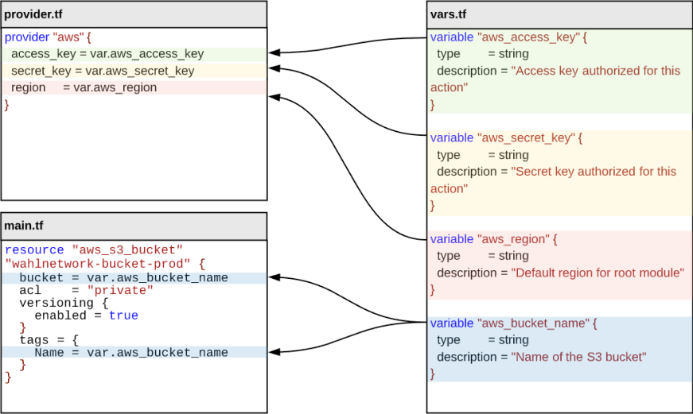

# Terraform Basic

Terraform이 인식하는 확장자는 HCL(Hashicorp Configuration Language) 언어로 작성된 *.tf 파일 입니다. Terraform은 파일 이름에 상관없이 디렉토리내의 모든 .tf
파이일을 프로비저닝 리소스를 정의하고 있다고 간주 합니다.  
또한 *.tfvars 는 테라폼 변수를 정의한 파일로 인식 합니다.

## Providers

AWS, GCP, AZure 와 같은 클라우드 환경에 리소스 및 서비스를 생성할 수 있도록 각각의 벤더가 제공하는 Open-API 를 통해 액세스하는 제공자 입니다. 이를 위해 CSP 벤더 + OpenSource
연합히 협력하여 프로바이더를 제공 합니다.

- AWS 클라우드를 액세스 하기위한 프로바이더 선언 예시

```hcl
provider "aws" {
  access_key = "<AWS_ACCESS_KEY>"
  secret_key = "<AWS_SECRET_KEY>"
  region     = "ap-northeast-2"
}
```

- GCP 클라우드를 액세스 하기위한 프로바이더 선언 예시

```hcl
provider "google" {
  project = "<MY-PROJECT-ID>"
  region  = "us-central1"
}
```

- AWS 및 GCP 를 모두 액세스 하는 멀티클라우드 프로비저닝을 위한 프로바이더 선언 예시

```hcl
terraform {
  required_version = ">= 1.0.0, < 2.0.0"

  required_providers {
    aws = {
      source  = "hashicorp/aws"
      version = "> 4.22.0"
    }
    google = {
      version = "~> 4.0.0"
    }
  }
}

provider "aws" {
  access_key = "<AWS_ACCESS_KEY>"
  secret_key = "<AWS_SECRET_KEY>"
  region     = "ap-northeast-2"
}

provider "google" {
  project = "<MY-PROJECT-ID>"
  region  = "us-central1"
  zone    = "us-central1-c"
}
```

<br>

## Resources

리소스란 프로바이더가 제공해주는 코드(resource)로 정의하여 인스턴트를 생성/수정/삭제 가능한 대상의 단위입니다.  
예를 들어 AWS 프로바이더가 제공하는 aws_instance 리소스 타입은 Amazon EC2 가상 머신을 코드(resource)로 선언하고 관리해주는 것이 가능 합니다.  


, 리소스, 변수, 아웃풋 의 이해

<br>


## Variables
리소스가 참조하는 값으로 `var.` 참조자로 값을 참조 할 수 있습니다.  



### local 변수 및 활용 
로컬 scope(범위)내에서만 유효한 값을 정의하여 참조 합니다. `local.` 참조자로 값을 참조 합니다.   
  


### 변수 입력 방식

- terraform apply 에서 입력

<br>

## Outputs
